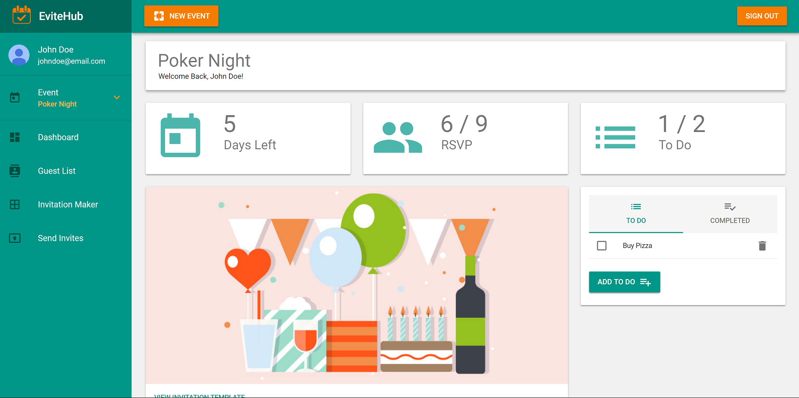

# EviteHub

Take the hassle out of Event Planning.

Link: http://evitehub.com

## Pages

* Dashboard: Keep track of number of days for your event, guest list, and to do list.

* Guest List: Manage your Guest List for your next event. Your Guest list can keep track of who's RSVP'd, Number of party for each guest, You can add guest to your Guest List anytime, Manage your guest contact information and more...

* Send Invites: Send invites or reminders to your guests.

## Tools used

* HTML 5
* CSS
* JavaScript
* [React.js](https://reactjs.org/)
* [Redux](https://redux.js.org/)
* [Material-UI](http://www.material-ui.com)
* [MongoDB](www.mongodb.com)
* [Auth0](https://auth0.com/)
* [Node.js](https://nodejs.org/)
